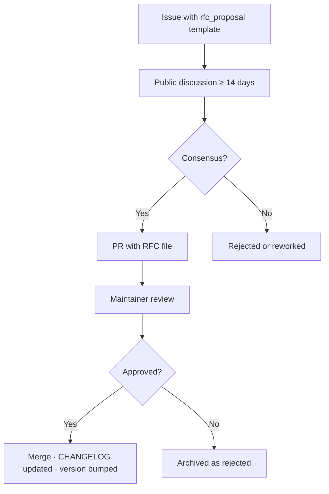

<!-- ═══════════════════════════════════════════════════════════════════════════ -->
<!--  KRONOS VAULT PROTOCOL · GOVERNANCE · v0.1.0                                 -->
<!--  github.com/Marcorojas17/kronos-protocol                                     -->
<!--  CC-BY-4.0 · DRAFT · subject to professional legal review                    -->
<!-- ═══════════════════════════════════════════════════════════════════════════ -->

```text
    ██████╗  ██████╗ ██╗   ██╗███████╗██████╗ ███╗   ██╗ █████╗ ███╗   ██╗ ██████╗███████╗
    ██╔════╝ ██╔═══██╗██║   ██║██╔════╝██╔══██╗████╗  ██║██╔══██╗████╗  ██║██╔════╝██╔════╝
    ██║  ███╗██║   ██║██║   ██║█████╗  ██████╔╝██╔██╗ ██║███████║██╔██╗ ██║██║     █████╗
    ██║   ██║██║   ██║╚██╗ ██╔╝██╔══╝  ██╔══██╗██║╚██╗██║██╔══██║██║╚██╗██║██║     ██╔══╝
    ╚██████╔╝╚██████╔╝ ╚████╔╝ ███████╗██║  ██║██║ ╚████║██║  ██║██║ ╚████║╚██████╗███████╗
     ╚═════╝  ╚═════╝   ╚═══╝  ╚══════╝╚═╝  ╚═╝╚═╝  ╚═══╝╚═╝  ╚═╝╚═╝  ╚═══╝ ╚═════╝╚══════╝
    ─────────────────────────────────────────────────────────────────────────────
    K R O N O S   ·   V A U L T   ·   G O V E R N A N C E
    ─────────────────────────────────────────────────────────────────────────────
```

> This document defines who decides what, how changes are approved, how
> conflicts are resolved, and how the project is expected to grow.
>
> Normative keywords **MUST**, **MUST NOT**, **SHOULD**, **SHOULD NOT**, and
> **MAY** are to be interpreted as described in RFC 2119 and RFC 8174.

```bash
$ ktp governance --status
─────────────────────────────────────────────────────────────────
  document ........ GOVERNANCE.md
  version ......... v0.1.0
  status .......... DRAFT · subject to legal review
  license ......... CC-BY-4.0
  maintainer ...... Marcorojas17
─────────────────────────────────────────────────────────────────
```

---

## `// 01` — SCOPE

This governance document applies to:

- The specification `protocol/KTP-001.md`
- All schemas under `protocol/schemas/`
- All test vectors under `protocol/test-vectors/`
- The conformance levels defined in `protocol/conformance/LEVELS.md`
- The RFC process in `protocol/rfcs/`
- The public documentation site under `docs/`

It does **NOT** apply to:

- The reference implementation, which follows its own contribution rules
- Trademarks and identifiers, defined separately in `brand/TRADEMARK.md`
- Third-party implementations of KTP

---

## `// 02` — ROLES

```text
┌─[ ROLES ]────────────────────────────────────────────────────────────────────┐
│                                                                              │
│  ▸ MAINTAINER                                                                │
│      Holds decision authority for the specification.                         │
│      Approves or rejects RFCs.                                               │
│      Manages releases and versioning.                                        │
│      Currently: Marcorojas17.                                                │
│                                                                              │
│  ▸ REVIEWERS                                                                 │
│      Invited without voting rights during Phase 1.                           │
│      Provide technical feedback on RFCs and PRs.                             │
│      MAY be promoted to voting members in Phase 2.                           │
│                                                                              │
│  ▸ CONTRIBUTORS                                                              │
│      Anyone who submits an issue, RFC, or pull request.                      │
│      MUST sign off commits per the DCO (see §06).                            │
│                                                                              │
└──────────────────────────────────────────────────────────────────────────────┘
```

---

## `// 03` — DECISION AUTHORITY

```bash
$ ktp governance --decisions
─────────────────────────────────────────────────────────────────
  Phase 1 (current)   Sole maintainer decides.
                      Reviewers advise; they do not vote.
                      All decisions documented in CHANGELOG.md.

  Phase 2 (planned)   Maintainer + voting reviewers.
                      Simple majority for routine changes.
                      Maintainer breaks ties.
                      Breaking changes require supermajority.
─────────────────────────────────────────────────────────────────
```

The current phase is declared in `CHANGELOG.md` at the repository root.
Phase transitions MUST be announced in a dedicated RFC.

---

## `// 04` — CHANGE CATEGORIES

Every change to the specification falls into one of the following categories.

```text
┌─[ CHANGE CLASSIFICATION ]────────────────────────────────────────────────────┐
│                                                                              │
│  EDITORIAL                                                                   │
│    Typo fixes, wording, formatting, non-normative clarifications.            │
│    Action: direct commit. No RFC required.                                   │
│                                                                              │
│  NORMATIVE-ADDITIVE                                                          │
│    Adds optional fields, new schemas, or new conformance helpers             │
│    without breaking existing implementations.                                │
│    Action: RFC required. Minor version bump.                                 │
│                                                                              │
│  NORMATIVE-BREAKING                                                          │
│    Changes required fields, semantics of existing fields,                    │
│    removes features, or alters canonicalization.                             │
│    Action: RFC required + supermajority. Major version bump.                 │
│                                                                              │
│  SECURITY-CRITICAL                                                           │
│    Mitigation of a disclosed vulnerability.                                  │
│    Action: expedited RFC. See §09.                                           │
│                                                                              │
└──────────────────────────────────────────────────────────────────────────────┘
```

---

## `// 05` — RFC PROCESS

Every non-editorial change MUST go through the RFC process described in
`protocol/rfcs/0000-process.md`. Summary:



Each RFC MUST be filed as `protocol/rfcs/NNNN-title.md`, numbered sequentially.

---

## `// 06` — CONTRIBUTIONS AND DCO

This project uses the **Developer Certificate of Origin** (DCO).
It does **NOT** require a Contributor License Agreement (CLA).

Every commit MUST contain a `Signed-off-by:` line, added via:

```bash
git commit -s -m "feat: add xyz"
```

Full DCO text: <https://developercertificate.org/>

A commit without `Signed-off-by` MUST be rejected by the maintainer.
This rule exists to keep contribution provenance auditable and to
comply with REUSE expectations.

---

## `// 07` — VERSIONING

The specification follows **Semantic Versioning 2.0.0**.

```text
┌─[ SEMVER MAPPING ]───────────────────────────────────────────────────────────┐
│                                                                              │
│  MAJOR   Breaking changes to the normative specification.                    │
│  MINOR   Backwards-compatible additions.                                     │
│  PATCH   Editorial and non-normative clarifications.                         │
│                                                                              │
└──────────────────────────────────────────────────────────────────────────────┘
```

The current version is declared in `protocol/CHANGELOG.md`.
Any change to the version MUST be reflected in:

- `protocol/CHANGELOG.md`
- `protocol/KTP-001.md` (header)
- `CHANGELOG.md` (root)
- The `ktp_version` field of every published schema

---

## `// 08` — CONFLICT RESOLUTION

Conflicts may arise between contributors, reviewers, or about
interpretation of the specification.

```text
  1.  Direct discussion in the relevant GitHub issue or PR.
  2.  If unresolved, the maintainer issues a written decision
      in the issue thread, with rationale.
  3.  If the decision changes the specification, an RFC is required.
  4.  Decisions are logged in CHANGELOG.md.
  5.  Once the project reaches Phase 2, a vote may be called
      (see §03).
```

The maintainer MUST document the rationale for any contested decision.

---

## `// 09` — SECURITY-CRITICAL CHANGES

For vulnerabilities affecting the specification, schemas, or test vectors:

```bash
$ ktp governance --security-path
─────────────────────────────────────────────────────────────────
  [1]  Private disclosure per SECURITY.md
  [2]  Maintainer confirms and classifies severity
  [3]  Expedited RFC: public discussion window shortened
       to 7 days
  [4]  Fix released as PATCH (or MINOR if interface changes)
  [5]  Coordinated public disclosure after fix
─────────────────────────────────────────────────────────────────
```

Response SLAs are defined in `SECURITY.md`.

---

## `// 10` — GROWTH

If the project reaches Phase 2 and gains external contributors:

- A minimum of **three** voting reviewers SHOULD be added.
- A public roadmap SHOULD be maintained in `docs/`.
- An annual review SHOULD verify that the governance document still
  reflects actual practice.
- If a foundation or host organization is later chosen, this
  document MUST be revised through an RFC.

No such organization is currently endorsed.

---

## `// 11` — TRADEMARK AND SEPARATION OF ROLES

Trademark status and permitted use of the project identifiers are
defined in `brand/TRADEMARK.md`.

The maintainer may simultaneously:

- Act as specification editor (this document).
- Hold trademark rights (see `brand/`).
- Offer optional professional services (see README §12).

These three roles are independent. Any decision that affects the
specification MUST be justified on technical grounds alone and MUST NOT
rely on commercial considerations.

---

## `// 12` — AMENDMENTS TO THIS DOCUMENT

This document MAY be amended via RFC. Amendments MUST be reflected in
`CHANGELOG.md` and, when relevant, announced on the repository.

---

## `// 13` — LEGAL REVIEW STATUS

```text
╔══════════════════════════════════════════════════════════════════════════════╗
║                                                                              ║
║  This governance document is a DRAFT and is subject to                       ║
║  PROFESSIONAL LEGAL REVIEW before being considered final.                    ║
║                                                                              ║
║  Contact: proyectokronos@hotmail.com                                         ║
║                                                                              ║
╚══════════════════════════════════════════════════════════════════════════════╝
```

---

<details>
<summary><b>🇬🇧 English summary</b> · click to expand</summary>

<br>

**Governance of the Kronos Vault Protocol**

- **Roles.** Maintainer (decision authority) · Reviewers (advisory in Phase 1) · Contributors (DCO-signed).
- **Decisions.** Phase 1: sole maintainer. Phase 2: majority vote with tie-break by maintainer.
- **Changes.** Editorial (direct commit) · Normative-additive (RFC + minor bump) · Normative-breaking (RFC + supermajority + major bump) · Security-critical (expedited RFC).
- **Contributions.** DCO (`Signed-off-by`); no CLA.
- **Versioning.** SemVer 2.0.0.
- **Security.** Coordinated disclosure per `SECURITY.md`.
- **Conflicts.** Documented, rationale required, escalated to RFC when normative.
- **Growth.** Phase 2 requires at least 3 voting reviewers.
- **Trademark.** Defined separately in `brand/TRADEMARK.md`.
- **Status.** Draft · subject to legal review.

</details>
📄 docs(governance): add GOVERNANCE.md v0.1.0

- Roles: maintainer, reviewers, contributors
- Decision authority: sole maintainer (Phase 1)
- Change categories: editorial, normative-additive,
  normative-breaking, security-critical
- RFC process with ≥14-day discussion window
- DCO required (no CLA)
- SemVer 2.0.0 mapping
- Conflict resolution and security-critical path
- Growth plan for Phase 2 (min 3 voting reviewers)

Signed-off-by: Marco Antonio Rojas Valdovinos <proyectokronos@hotmail.com>

---

*Last updated: 2026-09-14 · Status: draft · v0.1.0*
