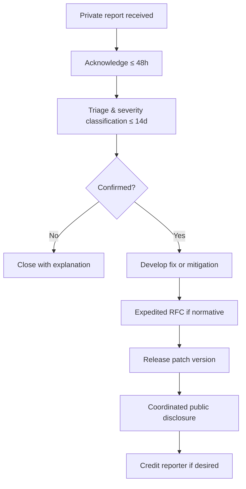

<!-- ═══════════════════════════════════════════════════════════════════════════ -->
<!--  KRONOS VAULT PROTOCOL · SECURITY · v0.1.0                                   -->
<!--  github.com/Marcorojas17/kronos-protocol                                     -->
<!--  CC-BY-4.0 · DRAFT · subject to professional legal review                    -->
<!-- ═══════════════════════════════════════════════════════════════════════════ -->

```text
    ███████╗███████╗ ██████╗██╗   ██╗██████╗ ██╗████████╗██╗   ██╗
    ██╔════╝██╔════╝██╔════╝██║   ██║██╔══██╗██║╚══██╔══╝╚██╗ ██╔╝
    ███████╗█████╗  ██║     ██║   ██║██████╔╝██║   ██║    ╚████╔╝
    ╚════██║██╔══╝  ██║     ██║   ██║██╔══██╗██║   ██║     ╚██╔╝
    ███████║███████╗╚██████╗╚██████╔╝██║  ██║██║   ██║      ██║
    ╚══════╝╚══════╝ ╚═════╝ ╚═════╝ ╚═╝  ╚═╝╚═╝   ╚═╝      ╚═╝
    ─────────────────────────────────────────────────────────────
    K R O N O S   ·   V A U L T   ·   S E C U R I T Y
    ─────────────────────────────────────────────────────────────
```

> This document defines how to report vulnerabilities, what SLAs to
> expect, how coordinated disclosure works, and how compromised keys
> are handled.
>
> Normative keywords **MUST**, **MUST NOT**, **SHOULD**, **SHOULD NOT**, and
> **MAY** are to be interpreted as described in RFC 2119 and RFC 8174.

```bash
$ ktp security --status
─────────────────────────────────────────────────────────────────
  document ........ SECURITY.md
  version ......... v0.1.0
  status .......... DRAFT · subject to legal review
  license ......... CC-BY-4.0
  contact ......... proyectokronos@hotmail.com
─────────────────────────────────────────────────────────────────
```

---

## `// 01` — SCOPE

This security policy applies to:

| Component | Path |
|-----------|------|
| Specification | `protocol/KTP-001.md` |
| JSON Schemas | `protocol/schemas/` |
| Test vectors | `protocol/test-vectors/` |
| Conformance levels | `protocol/conformance/` |
| Reference implementation | `reference-implementation/` (when added) |

**Out of scope:**

- Third-party implementations of KTP.
- Products or services built on top of the standard.
- General GitHub account issues (report to GitHub).
- Email or infrastructure issues unrelated to this repository.

---

## `// 02` — REPORTING A VULNERABILITY

```text
┌─[ REPORTING CHANNEL ]────────────────────────────────────────────────────────┐
│                                                                              │
│  DO NOT open a public GitHub issue for security vulnerabilities.            │
│                                                                              │
│  Preferred channel:                                                          │
│    Email: proyectokronos@hotmail.com                                         │
│    Subject prefix: [SECURITY] kronos-protocol                                │
│                                                                              │
│  Alternative channel:                                                        │
│    GitHub Private Security Advisory                                          │
│    github.com/Marcorojas17/kronos-protocol/security/advisories/new           │
│                                                                              │
└──────────────────────────────────────────────────────────────────────────────┘
```

### What to include in your report

- **Description** of the vulnerability.
- **Impact** — what an attacker could do.
- **Reproduction steps** — minimal and reproducible.
- **Affected version** — spec version, schema version, commit hash.
- **Suggested fix** — if you have one.
- **Your contact** — how we can follow up.

If you encrypt sensitive material, request a public key first.

---

## `// 03` — RESPONSE SLAs

```bash
$ ktp security --sla
─────────────────────────────────────────────────────────────────
  [01]  Acknowledgment ............ within 48 hours
  [02]  Initial triage ............ within 14 days
  [03]  Status update ............. every 14 days until resolution
  [04]  Fix or mitigation ......... within 90 days
  [05]  Coordinated disclosure .... default 90 days
─────────────────────────────────────────────────────────────────
```

These SLAs are **targets**, not guarantees. Phase 1 relies on a single
maintainer. If a delay occurs, the maintainer MUST communicate it in
the disclosure thread.

---

## `// 04` — VULNERABILITY HANDLING PROCESS



### Severity classification

| Level | Definition | Target fix |
|:-----:|------------|:----------:|
| Critical | Breaks core integrity or allows forgery | 14 days |
| High | Compromises verification or anchoring | 30 days |
| Medium | Weakens security under specific conditions | 60 days |
| Low | Minor information leak or hardening gap | 90 days |

---

## `// 05` — COORDINATED DISCLOSURE

```text
┌─[ DISCLOSURE WINDOW ]────────────────────────────────────────────────────────┐
│                                                                              │
│  Default embargo ...... 90 days from acknowledgment                         │
│  Extension ........... by mutual agreement, documented in writing            │
│  Shorter window ....... if the vulnerability is actively exploited          │
│                                                                              │
│  During the embargo:                                                         │
│    ▸ The maintainer works on the fix.                                        │
│    ▸ The reporter agrees not to publish details.                             │
│    ▸ Both parties may share information with trusted parties under NDA.      │
│                                                                              │
│  At the end of the embargo:                                                  │
│    ▸ A security advisory is published.                                       │
│    ▸ The reporter is credited (unless anonymity is requested).               │
│    ▸ Users are advised to update.                                            │
│                                                                              │
└──────────────────────────────────────────────────────────────────────────────┘
```

The maintainer MAY publish the advisory earlier if:

- The vulnerability is being actively exploited.
- The reporter requests it and the maintainer agrees.
- A third party independently discloses the issue.

---

## `// 06` — KEY COMPROMISE AND REVOCATION

This section applies when a signing key, timestamping key, or
anchoring key used by an implementation or by the project itself
is suspected or confirmed compromised.

### Detection

Signals that SHOULD trigger investigation:

- Unexpected signature appearing under a known key.
- Timestamp mismatch across independent TSAs.
- Anomalous anchor on a public chain.
- Reporter disclosure of key exfiltration.

### Response

```bash
$ ktp security --key-compromise
─────────────────────────────────────────────────────────────────
  [1]  Immediately mark the key as SUSPECT in the advisory.
  [2]  If confirmed, publish a KEY REVOCATION notice.
  [3]  Update any published JWKS or public key registry.
  [4]  Regenerate the key under a new key ID.
  [5]  Re-sign or re-anchor affected artifacts when feasible.
  [6]  Notify downstream implementers.
─────────────────────────────────────────────────────────────────
```

### Publication

Key revocations MUST be published in:

- A dedicated section of the security advisory.
- `evidence/` or a future `revocations/` directory.
- Any public key registry maintained by the project.

### Post-mortem

After a confirmed key compromise, the maintainer SHOULD publish a
post-mortem covering:

- Timeline of events.
- Root cause.
- Scope of impact.
- Preventive measures.

---

## `// 07` — SAFE HARBOR

```text
╔══════════════════════════════════════════════════════════════════════════════╗
║                                                                              ║
║  The maintainer will NOT pursue legal action against researchers             ║
║  who:                                                                        ║
║                                                                              ║
║    ▸ Act in good faith.                                                      ║
║    ▸ Follow this policy.                                                     ║
║    ▸ Avoid privacy violations, data destruction, or service disruption.      ║
║    ▸ Give reasonable time to fix before public disclosure.                   ║
║                                                                              ║
║  Reports made in good faith under this policy will be treated as             ║
║  authorized security research.                                               ║
║                                                                              ║
╚══════════════════════════════════════════════════════════════════════════════╝
```

---

## `// 08` — OUT OF SCOPE

The following are **not** considered vulnerabilities under this policy:

- Attacks requiring physical access to a user's device.
- Social engineering of maintainers or users.
- Denial-of-service against GitHub infrastructure.
- Bugs in third-party dependencies (report upstream).
- Missing features or design preferences.
- Self-XSS or clickjacking on pages without sensitive actions.
- Reports generated solely by automated scanners without proof.

---

## `// 09` — RECOGNITION

With the reporter's consent, the project MAY publish:

- The reporter's name or handle.
- A short description of the contribution.
- A link to the reporter's chosen profile.

Anonymous reports are accepted and respected.

A `SECURITY-HALL-OF-FAME.md` file MAY be created once the first
vulnerability is responsibly disclosed and resolved.

---

## `// 10` — CONTACT

```bash
$ ktp security --contact
─────────────────────────────────────────────────────────────────
  primary ......... proyectokronos@hotmail.com
  subject prefix .. [SECURITY] kronos-protocol
  advisory ........ github.com/Marcorojas17/kronos-protocol
                    /security/advisories/new
  pgp ............. not yet available
─────────────────────────────────────────────────────────────────
```

For non-security issues, use the GitHub issue tracker.

---

## `// 11` — LEGAL REVIEW STATUS

```text
╔══════════════════════════════════════════════════════════════════════════════╗
║                                                                              ║
║  This security policy is a DRAFT and is subject to                           ║
║  PROFESSIONAL LEGAL REVIEW before being considered final.                    ║
║                                                                              ║
║  Contact: proyectokronos@hotmail.com                                         ║
║                                                                              ║
╚══════════════════════════════════════════════════════════════════════════════╝
```

---

<details>
<summary><b>🇬🇧 English summary</b> · click to expand</summary>

<br>

**Security Policy · Kronos Vault Protocol**

- **Report privately:** `proyectokronos@hotmail.com` or GitHub Private Security Advisory. Do not open a public issue.
- **SLAs:** 48h acknowledgment · 14-day triage · 90-day fix target · 90-day coordinated disclosure (default).
- **Severity:** Critical (14d) · High (30d) · Medium (60d) · Low (90d).
- **Key compromise:** revocation notice, key regeneration, downstream notification, post-mortem.
- **Safe harbor:** good-faith research under this policy is authorized.
- **Out of scope:** physical access, social engineering, DoS, upstream dependency bugs, automated scanner noise.
- **Status:** Draft · subject to legal review.

</details>

---

*Last updated: 2026-09-14 · Status: draft · v0.1.0*
