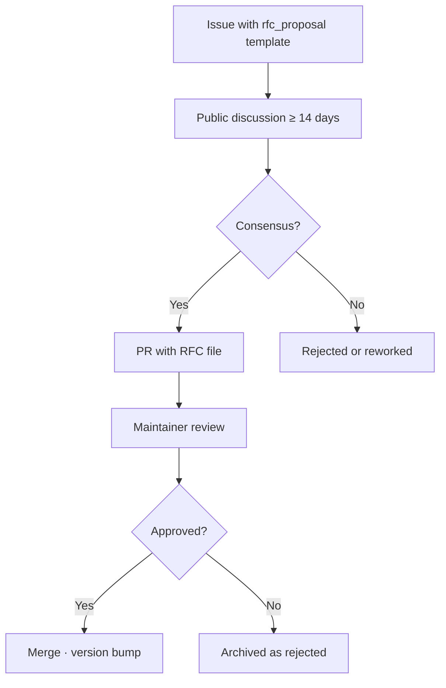

# RFC 0000 · Change Process

- **Status:** FINAL
- **Version:** 0.1.0
- **License:** CC-BY-4.0

## 1. Purpose

Define the process for proposing, discussing, and approving changes
to the KTP specification.

## 2. Principles

- Open to anyone.
- Public discussion.
- Documented rationale.
- Reversible decisions, irreversible rationale.

## 3. States

```
DRAFT → PROPOSED → ACCEPTED → FINAL
           ↓
       REJECTED / WITHDRAWN
                          ↓
                    DEPRECATED
```

## 4. Process



## 5. Requirements

- Every RFC file MUST live in this directory.
- File name MUST be `NNNN-title.md`, sequential.
- Discussion window MUST be at least 14 days.
- Every commit MUST be signed off per DCO.

## 6. Voting

- Phase 1: the maintainer decides.
- Phase 2: simple majority of voting reviewers.
- Tie-break: maintainer.

## 7. Version bumps

| Change | Bump |
|--------|:----:|
| Editorial | PATCH |
| Additive | MINOR |
| Breaking | MAJOR |

## 8. Emergency

Security-critical changes may use an expedited window of 7 days,
documented in the corresponding RFC.

---

*Last updated: 2026-09-14*
